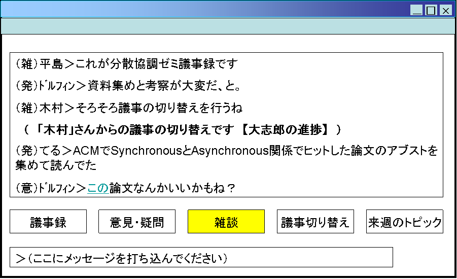
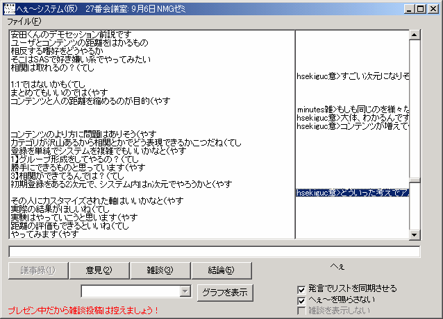

# Hexe System（へぇ～システム）

学会・会議における聴衆参加型リアルタイムフィードバックシステム（2003年開発）

> **IEEE Paper:** [Development and Evaluation of a Minutes System Focusing on Importance in the Meeting](https://ieeexplore.ieee.org/document/1283806/) — Daishiro Hirashima, Michiru Tanaka, Yoshimi Teshigawara, *Proceedings of the 18th International Conference on Advanced Information Networking and Applications (AINA 2004)*

## Note on Source Code Preservation

This repository contains the original source code from 2003, published as-is to preserve its full historical value. The code includes hardcoded usernames, IP addresses, database connection strings, and organization names that were typical of university research projects of that era. These artifacts are retained intentionally as part of the historical record. The systems and networks referenced have long since been decommissioned.

## 概要

「へぇ～システム」は、2003年にIEEE AINA 2004学会で発表された会議参加支援システムです。会議で生成される発表資料・テキスト議事録・映像音声などの多様なデータを自動収集し、参加者が投入した「重要度」情報に基づいて会議の要点を可視化するシステムを提案・開発しました。テレビ番組「トリビアの泉」の「へぇ～ボタン」にインスパイアされたリアルタイムフィードバック機構を備え、現在のSlido・Mentimeterに通じる聴衆参加型の仕組みを2003年の時点で実現していました。

## Screenshots

**Textmedia Recorder — Prototype Version 1**



**Textmedia Recorder — Prototype Version 1 (with Hexe features)**


**Textmedia Recorder — Prototype Version 2 (dual-pane layout)**



## 開発

- **開発者:** 平島大志郎 (Daishiro Hirashima)
- **所属:** 創価大学 勅使河原研究室
- **開発年:** 2003年
- **開発言語:** Visual Basic 6.0

## システム構成

```
hexe_system/
├── MainSystem/          # メインシステム（中核）
├── GraphicSystem/       # グラフィックシステム（UI拡張版）
├── LocalChatSystem/     # ローカルチャット（UDP通信プロトタイプ）
├── NotifySystem/        # ファイル変更監視ユーティリティ
└── docs/                # PostgreSQL構築手順・スクリーンショット
```

### MainSystem（メインシステム）

プロジェクト名: `DICOMO2003`

| フォーム | 役割 |
|---------|------|
| `frmLogin` | ログイン画面（ユーザーID + 会議ID） |
| `frmMain` | メイン画面（チャット + へぇ～ボタン） |
| `frmGraph` | リアルタイムグラフ（へぇ～推移の折れ線グラフ） |
| `frmODBCLogon` | ODBC接続設定画面 |
| `psql` | PostgreSQLテスト用画面 |

### GraphicSystem（グラフィックシステム）

MainSystemの発展版。単一チャットパネル、6種のメッセージボタン（議事録/意見・答弁/エヌ/議題切替/論点/本日のトピック）を持つ。

### LocalChatSystem（ローカルチャットシステム）

UDP通信の基本テスト用シンプルチャットアプリケーション。

### NotifySystem（ファイル変更監視）

Win32 API (`FindFirstChangeNotification`) を使用した指定ディレクトリのファイル変更検知ツール。

## 主要機能

### 1. へぇ～ボタン（リアルタイムフィードバック）

- **Ctrlキー押下**で「へぇ～」をカウント + 効果音再生
- 5秒間隔でPostgreSQLに記録（最大5回/5秒の上限制限）
- `frmGraph`で全参加者の関心度推移をリアルタイム折れ線グラフとして可視化

### 2. カテゴリ別メッセージング

| カテゴリ | 入力者 | 表示先 |
|---------|--------|--------|
| 議事録 | 議事録担当者(minutes)のみ | 左パネル |
| 意見 | 一般参加者 | 右パネル |
| エヌ（雑談） | 一般参加者 | 右パネル（フィルタ可） |
| 論点 | 一般参加者 | 右パネル |

### 3. 会議議題トラッキング

議題の切り替えを全端末にブロードキャスト通知し、各議題の開始・終了時刻をDBに記録。

### 4. UDP ブロードキャスト通信

```
送信: Port 8001 → ブロードキャスト 255.255.255.255:8002
受信: Port 8002
```

サーバー不要のP2P型LAN内リアルタイム通信。

## 技術スタック

| 要素 | 技術 |
|------|------|
| 言語 | Visual Basic 6.0 |
| データベース | PostgreSQL (Cygwin上) |
| DB接続 | ADO (MSDASQL) + ODBC |
| 通信 | Winsock (UDP ブロードキャスト) |
| 音声再生 | Win32 API (PlaySound) |
| ファイル監視 | Win32 API (FindFirstChangeNotification) |

## データベーススキーマ

### hexe テーブル（へぇ～記録）

| カラム | 型 | 説明 |
|--------|------|------|
| id | SERIAL | 主キー (hexe_id_seq) |
| user_id | INTEGER | ユーザーID |
| h_type | INTEGER | へぇ～の種別 |
| push_time | TIMESTAMP | 記録時刻 |
| times | INTEGER | 5秒間のへぇ～回数 |
| conf_id | INTEGER | 会議ID |

### minutes テーブル（発言記録）

| カラム | 型 | 説明 |
|--------|------|------|
| id | SERIAL | 主キー (minutes_id_seq) |
| user_id | INTEGER | ユーザーID |
| c_type | INTEGER | 発言種別 (0=議事録, 1=意見, 2=エヌ, 4=論点) |
| timestamp | TIMESTAMP | 発言時刻 |
| message | TEXT | 発言内容 |
| conf_id | INTEGER | 会議ID |

### conf_detail テーブル（会議詳細記録）

| カラム | 型 | 説明 |
|--------|------|------|
| id | SERIAL | 主キー |
| user_id | INTEGER | ユーザーID |
| cd_type | INTEGER | 議題種別 |
| s_time | TIMESTAMP | 開始時刻 |
| e_time | TIMESTAMP | 終了時刻 |
| conf_id | INTEGER | 会議ID |

## 環境構築（当時の手順）

```bash
# 1. Cygwin 起動
# 2. ipc-daemon 起動
ipc-daemon &
# 3. PostgreSQL 起動
pg_ctl -o "-S -i" start
# 4. データベース接続
psql データベース名
# 5. PostgreSQL 停止
pg_ctl stop
```

## ビルド方法

1. Visual Basic 6.0 (SP6) をインストール
2. 各サブシステムの `.vbp` ファイルをVB6 IDEで開く
3. 必要なOCXコンポーネント:
   - `MSWINSCK.OCX` (Microsoft Winsock Control)
   - `COMDLG32.OCX` (Microsoft Common Dialog Control)
4. 参照設定:
   - Microsoft ActiveX Data Objects 2.7 Library (`msado15.dll`)
5. メニュー「ファイル → EXEの作成」でビルド

## ライセンス

Copyright (c) 2003 Daishiro Hirashima. All rights reserved.
